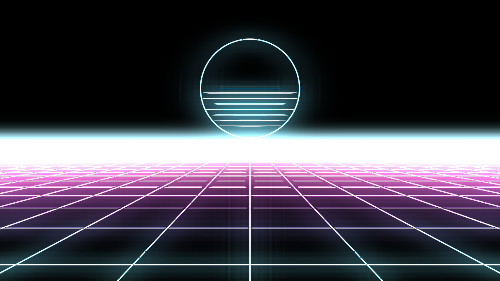

# outrun user guide

outrun draws **neon synthwave strokes** for [Resolume](https://resolume.com) Arena and Avenue, as
a pair of FFGL plugins.

- **Outrun** (a source) generates neon paths from nothing: the perspective grid with its striped
  sun, tunnel rings, hex lattices, circuit traces, a city skyline over folded mountains, a spinning
  star, a Lissajous figure — or the routed audio as a mirrored oscilloscope trace.
- **Outrun Trace** (an effect) finds the outlines in whatever is on the layer and draws them as
  continuous glowing neon tubes — and then lets them **break away** from the real geometry.



> **Before you rely on this:** the palette lookup is mirrored in C++ and checked against the GLSL
> that ships. The path and breakaway maths is GPU-only and has no mirror, so it is proven instead
> by contact sheets that render **every** path and **every** break mode and assert each one is live
> and distinct from its neighbours, plus a control sweep that fails if any parameter turns out to
> do nothing.
>
> That is a weaker guarantee than a numerical mirror, and worth knowing: it establishes that each
> mode does something different from the others, not that any one of them is arithmetically
> correct. Try it on a spare layer before a show.
>
> This codebase was created with AI assistance, directed and reviewed by a human author.

---

## Installing

Drop the bundle (macOS) or the DLL (Windows) into Resolume's plugin folder and restart:

```
~/Documents/Resolume Arena/Extra Effects      (or "Resolume Avenue")
```

The released macOS builds are **Developer ID-signed and notarised**, so they load with no
Gatekeeper step. The Windows builds are unsigned and SmartScreen warns once — see
[UNSIGNED.md](UNSIGNED.md), which also covers a bundle you build yourself.

"Outrun" appears under Effects. **Engine B needs any clip under it** — a solid black clip works,
and the Background modes decide whether that clip shows.

---

## Two engines, one plugin

**Engine** is the first control to set, because it decides what the rest of the parameter list
means.

**Engine A traces the clip.** It is an edge detector feeding a neon tube renderer.

**Engine B generates paths** from nothing at all. The clip underneath is only there because FFGL
wants one.

---

## Engine A: get the outline right first

Everything downstream is lighting an outline, so set the outline before touching anything else —
**and set it while you can see it.** Put the background on **Edges**, which shows the raw mask with
no tubes, no colour and no glow in the way.

| | |
| --- | --- |
| **Detect On** | Which channel counts as an edge. **Luma** for footage; **Alpha** for a logo delivered with transparency, whose alpha channel is already a perfect outline. |
| **Sensitivity** | How strong a boundary has to be to count. |
| **Softness** | How abrupt the threshold is. |
| **Detail** | What *scale* the detector works at. Low finds sensor noise; high finds the shape of a logo and ignores the texture inside it. |
| **Stability** | How long an edge survives a flickery frame. This is the one that makes it usable on video rather than only on stills. |

Then set **Trace**, which decides how colour runs along the outline, and put the background back
where you want it.

---

## Breakaway: the reason the effect exists

**Break Amount at 0 is the faithful outline.** Wind it up and the strokes leave the real geometry
for a synthetic pattern:

- **echoes** drifting outward from the shape;
- outlines snapped to **45° technical linework**;
- **scanline glitches**;
- a **flow field**;
- **comet rays**.

Because it morphs rather than switches, the useful settings are usually in the middle — recognisably
the logo, but coming apart. **Spread** controls how far the copies go, and there is a per-copy
palette shift so the echoes are not all one colour.

---

## Engine B: the paths

The perspective grid with the striped sun, tunnel rings, hex lattices, circuit traces, a city
skyline over folded mountains, a spinning star, a Lissajous figure, and **Waveform** — the routed
audio drawn as a mirrored oscilloscope trace.

Each has a size, a density and a horizon position.

---

## Stroke and colour

**Width** is the tube's thickness in pixels, so a stroke is the same weight wherever it lands in
the frame. **Core** is how much of the tube saturates to white — that hot centre is most of what
reads as neon rather than as a coloured line.

Colour comes from **sixteen authored synthwave palettes**, from two swatches of your own, or **from
the clip's own colours along its own outline** — that last one is the interesting option on Engine
A, because a logo lights its own edge in its own brand colours. **Spread** is how many times the
palette is laid along a run.

---

## Tempo and audio

**Tempo** runs free, locks to Resolume's beat or bar, or goes **manual** — and manual is the mode
to reach for when you want Resolume's own BPM-synced animation, a keyframe or a MIDI fader driving
**Phase**.

Route audio into the **Audio** picker, then:

- **Audio Level** lays the spectrum along the strokes as a brightness gate.
- **Audio Break** lets the bass shove the strokes off the geometry — the breakaway, driven by the
  track.
- The **Waveform** path draws the spectrum itself.

Audio Break is the one worth spending time on: it ties the effect's biggest gesture to the loudest
part of the mix, which is a different feel from a brightness pump.

---

## If it looks wrong

**Engine B renders nothing.** There is no clip under it. Put a black clip on the layer.

**The trace finds confetti, not an outline.** Raise **Detail** so the detector works at a coarser
scale, then raise **Sensitivity**. Judge both on the **Edges** background.

**A logo with transparency traces badly.** Set **Detect On** to **Alpha**. Its alpha channel is
already a clean outline, and running a brightness detector over it throws that away.

**Everything flickers on video.** Raise **Stability**, then **Detail** — most edge flicker is the
detector finding texture rather than shape.

**It reads as coloured lines, not neon.** Raise **Core**. The white-hot centre is the effect.

**Nothing responds to the music.** Nothing is routed on the **Audio** picker, or Audio Level and
Audio Break are both at zero — they start there deliberately.
